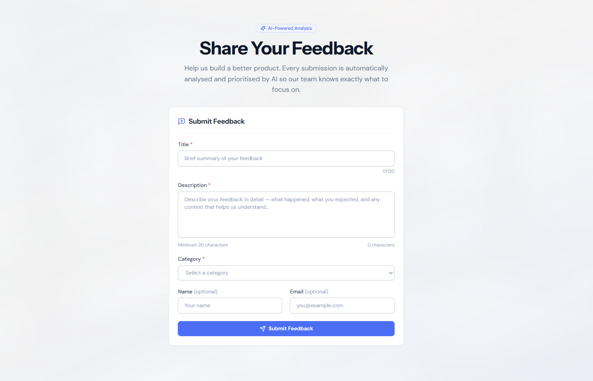
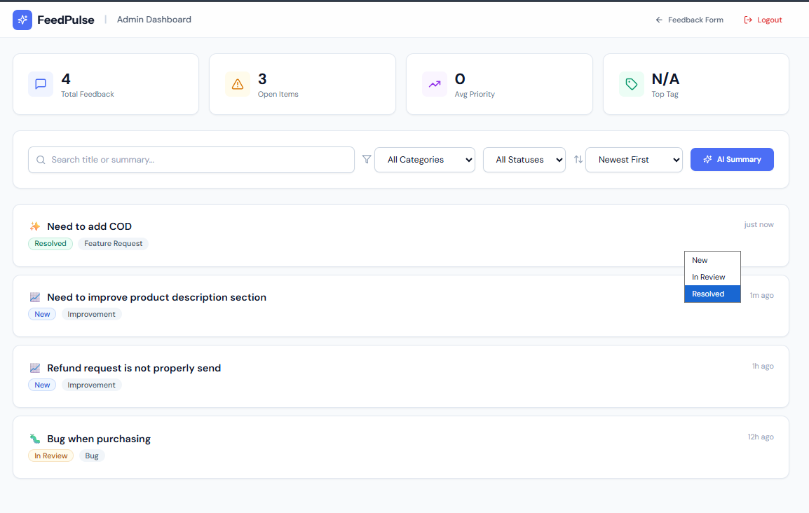
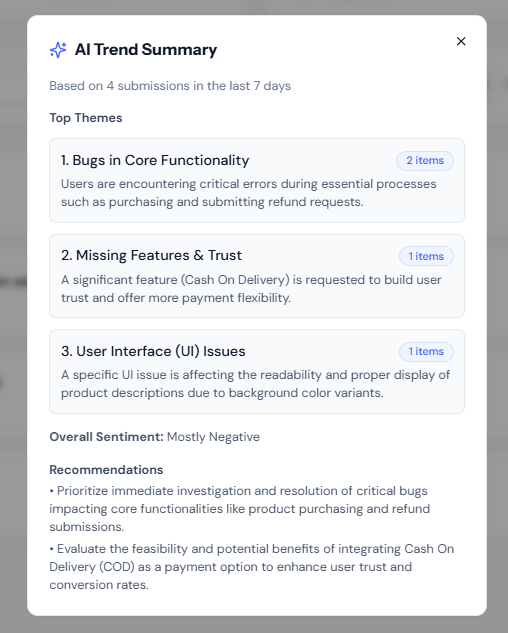
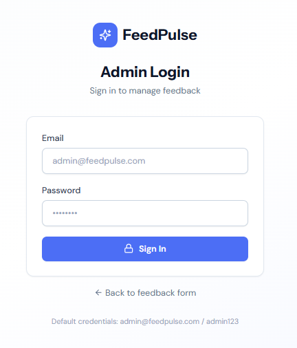

# FeedPulse — AI-Powered Product Feedback Platform

> A full-stack internal tool that lets teams collect product feedback and feature requests, then uses **Google Gemini AI** to automatically categorise, prioritise, and summarise them — giving product teams instant clarity on what to build next.







---

## Tech Stack

| Technology | Purpose |
|---|---|
| **Next.js 14** (App Router) | Frontend — React Server Components, pages & UI |
| **Node.js + Express** | Backend API — REST endpoints, middleware, business logic |
| **TypeScript** | Full-stack type safety |
| **MongoDB + Mongoose** | Database — feedback, users, tags, and AI analysis results |
| **Google Gemini AI** (gemini-1.5-flash) | AI categorisation, summarisation & priority scoring |
| **Tailwind CSS** | Styling |
| **JWT** | Admin authentication |
| **Docker + Docker Compose** | Containerised deployment |
| **Jest + Supertest** | Unit testing |

---

## Features

### Core Features
- **Public Feedback Form** — Clean submission form with validation, character counter, and success/error states
- **AI-Powered Analysis** — Every submission is automatically analysed by Gemini for category, sentiment, priority (1-10), summary, and tags
- **Admin Dashboard** — Protected view with login, feedback management, and status updates
- **Filtering & Sorting** — Filter by category and status; sort by date, priority, or sentiment
- **Search** — Full-text search across titles and AI summaries
- **Pagination** — 10 items per page with navigation controls
- **Stats Bar** — Total feedback, open items, average priority, most common tag

### AI Features
- Automatic categorisation, sentiment analysis, priority scoring, and tag generation
- On-demand AI trend summary (top 3 themes from last 7 days)
- Re-trigger AI analysis on any submission

### Security
- JWT-based admin authentication with User collection in MongoDB
- Input sanitisation (HTML stripping)
- Rate limiting (5 submissions per IP per hour)
- Environment variables for all secrets

---

## How to Run Locally

### Prerequisites
- **Node.js** 18+ and **npm**
- **MongoDB** running locally (or a MongoDB Atlas connection string)
- A free **Google Gemini API key** from [aistudio.google.com](https://aistudio.google.com)

### Step 1: Clone the repository
```bash
git clone https://github.com/YOUR_USERNAME/feedpulse.git
cd feedpulse
```

### Step 2: Setup the Backend
```bash
cd backend
npm install

# Create .env file
cp .env.example .env
# Edit .env with your values:
#   MONGO_URI=mongodb://localhost:27017/feedpulse
#   GEMINI_API_KEY=your_api_key_here
#   JWT_SECRET=your_secret_here

# Start the backend
npm run dev
```
The API will run on `http://localhost:4000`.

### Step 3: Setup the Frontend
```bash
cd ../frontend
npm install

# Create .env.local file
cp .env.example .env.local

# Start the frontend
npm run dev
```
The app will run on `http://localhost:3000`.

### Step 4: Login to Dashboard
Navigate to `http://localhost:3000/login` and use:
- **Email:** `admin@feedpulse.com`
- **Password:** `admin123`

---

## Running with Docker

```bash
# From the project root
GEMINI_API_KEY=your_key_here docker-compose up --build
```

This starts the frontend (port 3000), backend (port 4000), and MongoDB (port 27017) with a single command.

---

## Environment Variables

### Backend (`backend/.env`)
| Variable | Description | Required |
|---|---|---|
| `MONGO_URI` | MongoDB connection string | Yes |
| `GEMINI_API_KEY` | Google Gemini API key | Yes |
| `JWT_SECRET` | Secret for JWT signing | Yes |
| `PORT` | API port (default: 4000) | No |
| `FRONTEND_URL` | Frontend URL for CORS (default: http://localhost:3000) | No |

### Frontend (`frontend/.env.local`)
| Variable | Description | Required |
|---|---|---|
| `NEXT_PUBLIC_API_URL` | Backend API URL (default: http://localhost:4000/api) | No |

---

## API Endpoints

| Method | Endpoint | Description | Auth |
|---|---|---|---|
| `POST` | `/api/feedback` | Submit new feedback | Public |
| `GET` | `/api/feedback` | Get all feedback (filters, pagination) | Admin |
| `GET` | `/api/feedback/summary` | AI-generated trend summary | Admin |
| `GET` | `/api/feedback/stats` | Dashboard statistics | Admin |
| `GET` | `/api/feedback/:id` | Get single feedback item | Admin |
| `PATCH` | `/api/feedback/:id` | Update feedback status | Admin |
| `DELETE` | `/api/feedback/:id` | Delete feedback | Admin |
| `POST` | `/api/feedback/:id/reanalyse` | Re-trigger AI analysis | Admin |
| `POST` | `/api/auth/login` | Admin login | Public |

All endpoints return consistent JSON: `{ success, data, error, message }`

---

## Running Tests

```bash
cd backend
npm install --save-dev mongodb-memory-server
npm test
```

Tests cover:
- Feedback submission (valid + invalid data)
- Input validation (empty title, short description, invalid category)
- Status updates
- Auth middleware (no token, invalid token, valid token)
- Login (valid + invalid credentials)
- Gemini service graceful degradation

---

## Project Structure

```
feedpulse/
├── frontend/                  ← Next.js 14 App
│   ├── app/
│   │   ├── layout.tsx         (Root layout)
│   │   ├── globals.css        (Tailwind + custom styles)
│   │   ├── page.tsx           (Public feedback form)
│   │   ├── login/page.tsx     (Admin login)
│   │   └── dashboard/
│   │       ├── layout.tsx     (Auth-protected layout)
│   │       └── page.tsx       (Admin dashboard)
│   ├── lib/
│   │   ├── api.ts             (Axios API client)
│   │   └── utils.ts           (Utility functions)
│   └── Dockerfile
│
├── backend/                   ← Node.js + Express API
│   ├── src/
│   │   ├── server.ts          (Entry point)
│   │   ├── routes/
│   │   │   ├── feedback.routes.ts
│   │   │   └── auth.routes.ts
│   │   ├── controllers/
│   │   │   ├── feedback.controller.ts
│   │   │   └── auth.controller.ts
│   │   ├── models/
│   │   │   ├── feedback.model.ts
│   │   │   └── user.model.ts
│   │   ├── services/
│   │   │   └── gemini.service.ts
│   │   ├── middleware/
│   │   │   ├── auth.middleware.ts
│   │   │   └── sanitize.middleware.ts
│   │   ├── utils/
│   │   │   └── apiResponse.ts
│   │   └── __tests__/
│   │       └── api.test.ts
│   └── Dockerfile
│
├── docker-compose.yml
├── .gitignore
└── README.md
```

---

## What I Would Build Next

If I had more time, I would add:

1. **Real-time Updates** — WebSocket integration so the dashboard updates live when new feedback arrives
2. **Email Notifications** — Notify the team via email when high-priority feedback (score ≥ 8) is submitted
3. **Export to CSV** — Allow admins to export filtered feedback data for reporting
4. **Feedback Upvoting** — Let users upvote existing feedback to surface the most requested features
5. **Multi-tenant Support** — Allow multiple product teams to have their own isolated feedback boards
6. **Analytics Dashboard** — Charts showing feedback trends over time (submissions per day, sentiment distribution, category breakdown)
7. **Webhook Integration** — Push new high-priority feedback to Slack or Discord channels
8. **Dark Mode** — A proper dark theme for the dashboard

---

## License

Built as a technical assignment submission.
